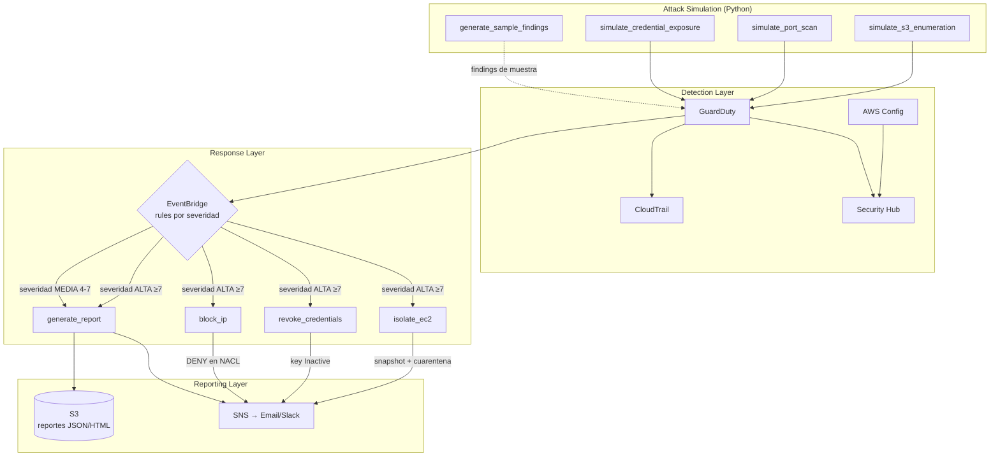
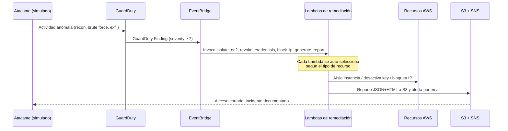

# Arquitectura

## Vista general

El sistema tiene cuatro capas: **simulación**, **detección**, **respuesta** y
**reporting**. Un ataque genera un finding en GuardDuty, EventBridge lo enruta
según severidad, las Lambdas remedian y todo queda documentado.



## Flujo de un incidente (severidad alta)



## Componentes clave

### Detección
- **GuardDuty** — motor de detección de amenazas (EC2, IAM, S3). Emite findings
  con un score de severidad 1–8.8.
- **CloudTrail** — log de auditoría de todas las API calls (un trail single-region
  = gratis). Encriptado y con validación de integridad.
- **AWS Config** — detecta misconfiguraciones con reglas managed (SSH abierto,
  S3 público, EC2 sin IMDSv2, IAM sin MFA).
- **Security Hub** — agrega findings de GuardDuty y los standards AWS Foundational
  + CIS en un solo lugar.

### Respuesta
- **EventBridge** — dos reglas por severidad (alta ≥7, media 4–7) más una de
  Config. Enruta a las Lambdas.
- **Lambdas** — Python 3.12, cada una con un rol IAM least-privilege (definidos en
  `terraform/iam.tf`). Empaquetadas y conectadas en `terraform/lambdas.tf`.

### Reporting
- **S3** — bucket privado y encriptado con los reportes (`reportes/AAAA/MM/DD/<id>.{json,html}`).
- **SNS** — topic con suscripción de email (y opcionalmente Slack).

## Decisiones de diseño

1. **Auto-selección en vez de dispatcher.** La regla de alta severidad dispara las
   4 Lambdas; cada una hace no-op si el finding no le corresponde. Funciones
   independientes, fáciles de testear por separado, sin un punto único de fallo.

2. **Snapshot antes de aislar.** `isolate_ec2` preserva evidencia forense antes de
   mover la instancia a cuarentena. Si el snapshot falla, igual aísla (la seguridad
   no se bloquea por la evidencia).

3. **Honeypot intencionalmente expuesto.** La EC2 abre SSH/HTTP al mundo a propósito
   para generar findings. Por eso `tfsec`/`Checkov` corren en `soft_fail`: esos
   hallazgos son esperados.

4. **VPC default reutilizada.** Para mantenerlo en free tier y simple, no se crea
   VPC propia. En producción usarías una VPC dedicada con subnets privadas.

## Generar el PNG (opcional)

El diagrama Mermaid se renderiza directo en GitHub. Si querés un `architecture.png`
para presentaciones:

```bash
npx @mermaid-js/mermaid-cli -i docs/architecture.md -o docs/architecture.png
```
